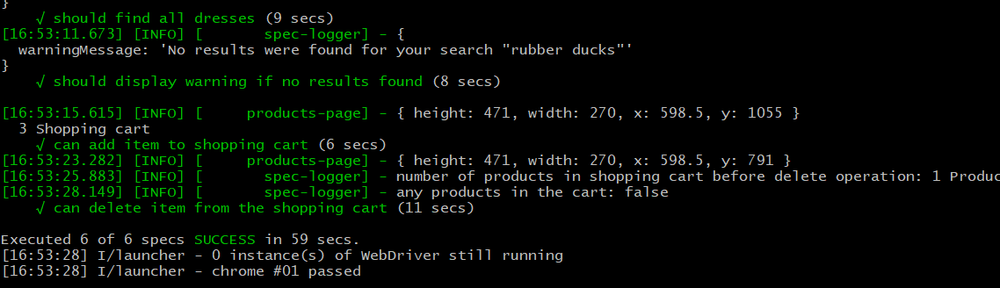
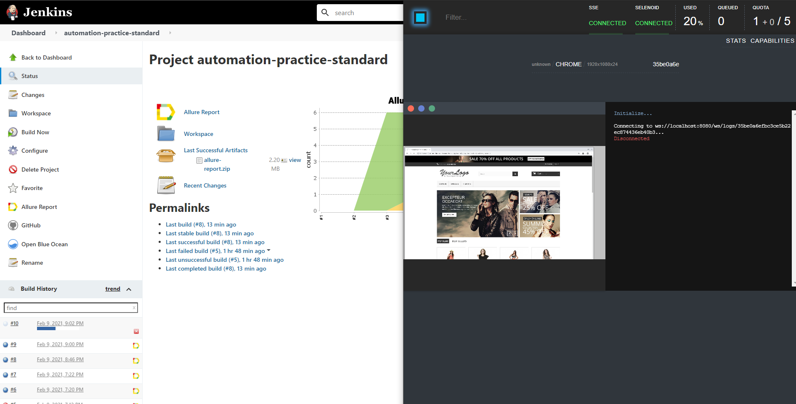
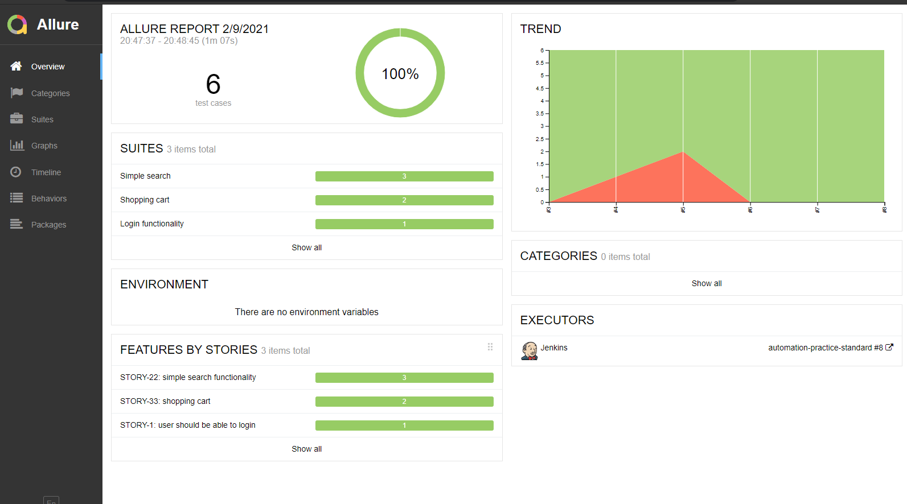
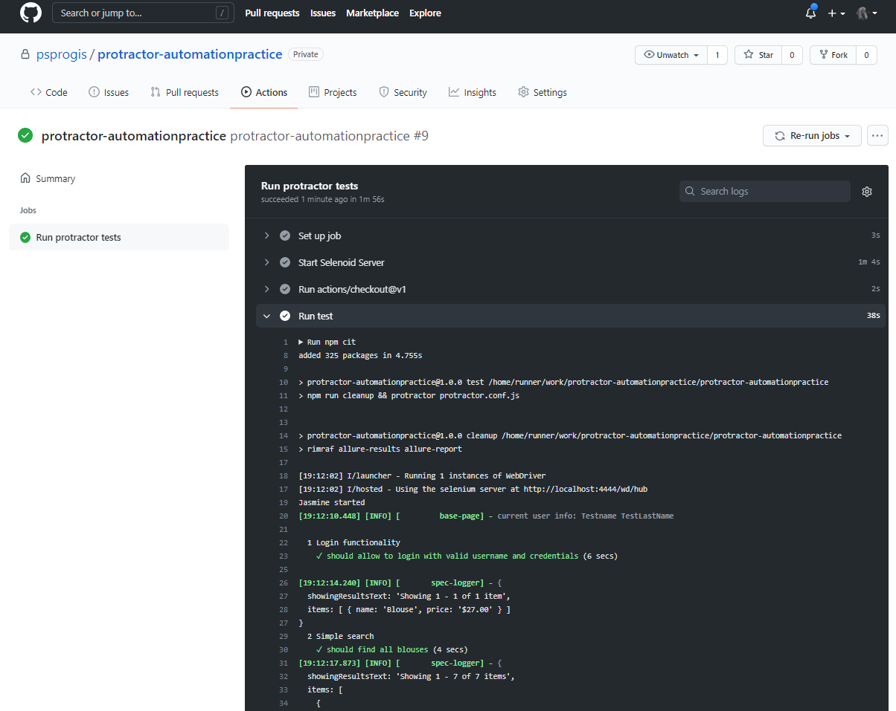
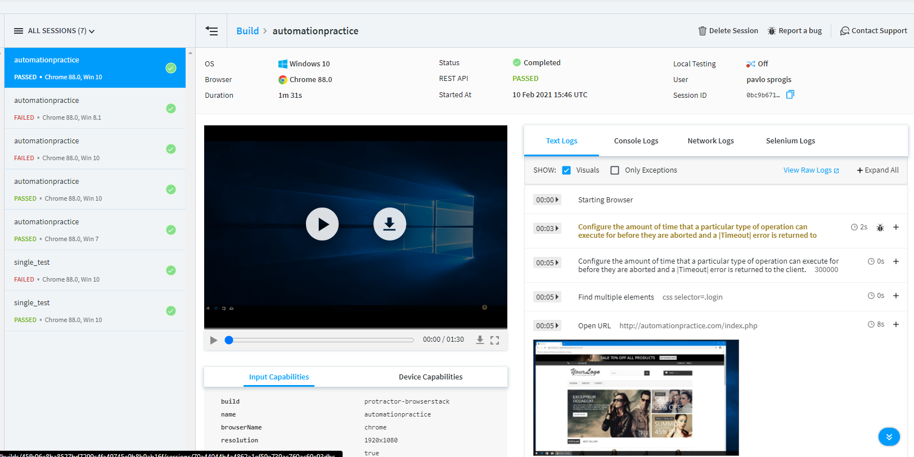

# UI assignment 
NOTE: this repo contains only some tests, as an example, it does not cover all the functionality of the site.

**Table of Contents**
1. [Task description](#task-description)
2. [TODO](#todo)
3. [Local run](#local-run)
    1. [Preconditions and environment](#preconditions-and-environment)
    2. [How to run](#how-to-run)
4. [Run on CI](#run-on-ci)
    1. [Local jenkins and selenoid](#local-jenkins-and-selenoid)
    2. [Github actions](#github-actions)
    3. [Gilab](#gitlab)   
    4. [Alternatives](#alternatives)
5. [Run tests in cloud](#run-tests-in-cloud)

## task description
Write an automated test for an e-commerce site, feel free to pick any:
(e.g. http://automationpractice.com/index.php):
- You could implement some of the following tests:
    - Login, searching for products using 3 different criteria, adding products to the cart, removing products from the cart, checkout process, if possible, implement a login and sign-up test;
    - Report any bugs you find by writing a bug ticket
- Please prepare a document with the test flows and test cases. The documents have to be clear both to the developer and to someone who is not familiar with the technology;
- Run tests in a continuous integration tool and optionally in the cloud.
- Please provide us steps how to run the written test

## todo
- create "fast login", add products to cart and other operations using post requests.
- configure separate timeouts: local run, browserstack run, etc.
- add allure steps.
- create Dockerfile for tests with proper node environment ?

## Local run
### Preconditions and environment
* Test should work on any linux/unix (CentOS, RedHat, Fedora, etc.) and Windows 10 (start from GitBash)
* node.js version v12.20.0 (or higher)
```bash
node -v
v12.20.0
```
* npm version 6.14.8. (package lock will be ignored with npm v less than 5)
```bash
npm -v
6.14.8
```
* (optional) webdriver-manager (installed with protractor), run `webdriver-manager update` to get the latest versions of drivers
```bash
npm ls -g webdriver-manager
/usr/local/lib
└─┬ protractor@7.0.0
  └── webdriver-manager@12.1.7

# status after update
webdriver-manager status
[18:05:42] I/status - selenium standalone version available: 3.141.59 [last]
[18:05:42] I/status - chromedriver versions available: 84.0.4147.30, 85.0.4183.87, 86.0.4240.22, 87.0.4280.88, 88.0.4324.96 [last]
[18:05:42] I/status - geckodriver versions available: v0.27.0, v0.29.0 [last]
[18:05:42] I/status - IEDriverServer is not present
[18:05:42] I/status - android-sdk is not present
[18:05:42] I/status - appium is not present
```
* Start selenium server
```bash
webdriver-manager start
```

### How to run
* Clone repo
* Install dependencies (`npm i`)
* Since we cannot create user before tests (yet) you should create 1 test user manually with `Testname` name and `TestLastName` lastname.
* Setup 2 env variables before stating tests: `TEST_USER` and `TEST_USER_PASSWORD`. They are required for `login.spec`.
* Run test (`npm t`)
* Open html report (```npm run report```)
```bash
cd protractor-automationpractice/
npm i
# ...
npm t
# ...
npm run report
# ...
Report successfully generated to allure-report
Starting web server...
# ...
```


## Run on CI
I will use the easiest setup: local jenkins + local selenoid. Jenkins can be installed locally or run as a [docker container](https://hub.docker.com/r/jenkins/jenkins).

### Local jenkins and selenoid
You can find details how to start selenoid locally here: [start selenoid](https://aerokube.com/selenoid/latest/)
Alternatively there is an existing Digital Ocean droplet with selenoid: [selenoid droplet](https://marketplace.digitalocean.com/apps/selenoid)



### Github actions
Repository contains .github/workflows folder with 1 workflow for github actions.


### Gitlab
Gitlab [project](https://gitlab.com/psprogis/protractor-automationpractice).

### Alternatives
I used Jenkins, GitHub Actions and Gitlab only as an example, but there are plenty of other good tools: Bamboo, TravisCI, TeamCity, etc.

## Run tests in cloud
There are at least 2 popular platforms: saucelab and [browserstack](https://www.browserstack.com/), I ran my tests on browserstack
[Setup for protractor](https://www.browserstack.com/docs/automate/selenium/getting-started/nodejs/protractor).
You should have browserstack account to repeat the following steps: 
```bash
# Setup 2 env variables before stating tests: TEST_USER and TEST_USER_PASSWORD for login.spec
# and setup 2 env variables: BROWSERSTACK_USERNAME and BROWSERSTACK_ACCESS_KEY for browserstack before run
cd protractor-automationpractice/
npm run test:browserstack
```

